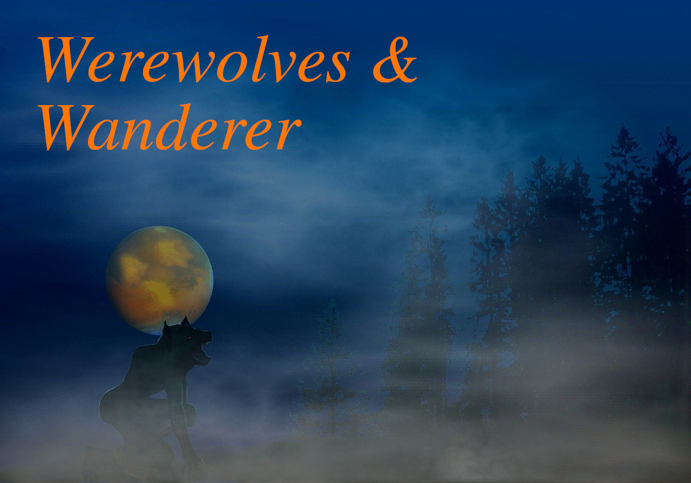

# werewolves-and-wanderer



## Preface
This textual adventure has been inspired by the famous CAGYC (Create Adventure
Games on Your Computer) book. The first chapters of this '80s masterpiece guides
the reader through a )
of Basic code.

Given that the most powerful GPU that we have in our possess is our own
***imagination***, creating and playing a textual adventure is the maximum
expression of this art. This is another option to enjoy writing code in Golang,
a very interesting programming language that caught my attention in the last
period.

## Getting started

How to build and play the game:

```bash
git clone git@github.com:A-725-K/werewolves-and-wanderer.git
cd werewolves-and-wanderer
just build
just play
```

## Author

* ***Andrea Canepa*** - 2023-2024
